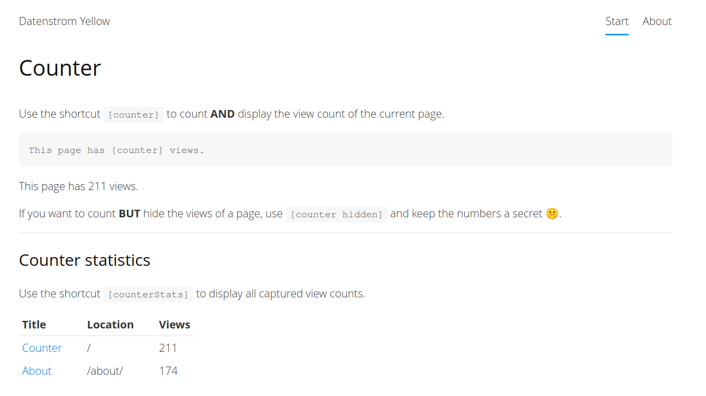

# Counter 0.1.0

Count page views.

## How to install an extension

[Download ZIP file](https://github.com/upputter/yellow-counter/archive/refs/heads/main.zip) and copy it into your `system/extensions` folder. [Learn more about extensions](https://github.com/annaesvensson/yellow-update).

## How to use the counter shortcut

Use the shortcut `[counter]` to count **AND** display the view count of the current page.

### Arguments

If you want to count **BUT** hide the views of a page, use the `hidden`-argument like `[counter hidden]` and keep the numbers a secret 🤫.

## How to get some statistics

You can simply open the defined `counterLogFile` in the `system/extensions/` (default `system/extensions/viewcounter.ini`) to get an overview of all counted page views

**OR**

use the shortcut `[counterStats]` on a page, to get a simple overview table.

## Settings
You can configure the following settings in the file `system/extensions/yellow-system.ini`:

  * `counterLogFile`: the file for logging all the views in the folder `system/extensions/`; default is `viewcounter.ini`
  * `counterMessageTemplate`: Text template for the counter; use `@counter` as placeholder

